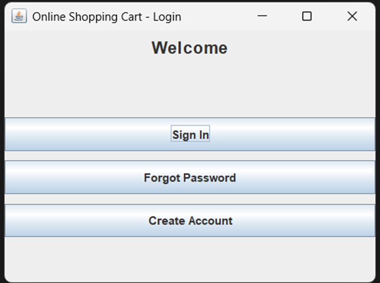
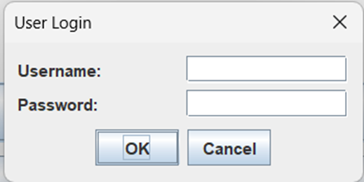
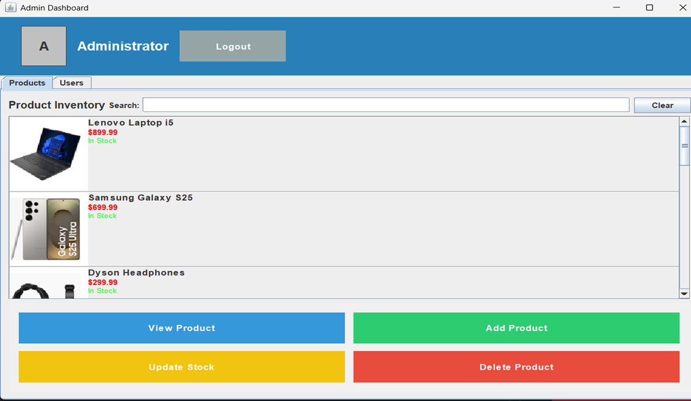
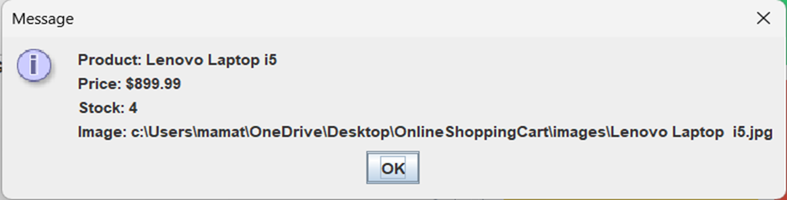
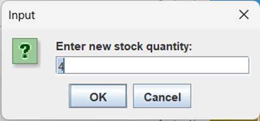
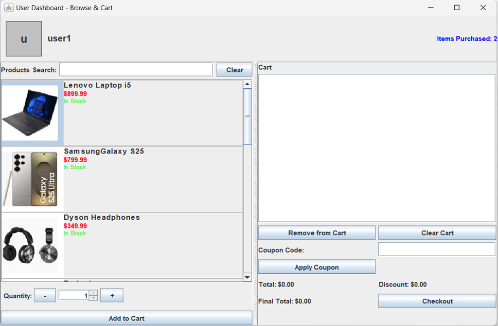
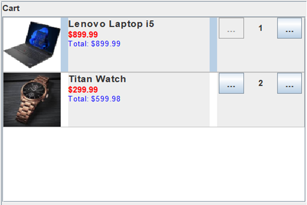
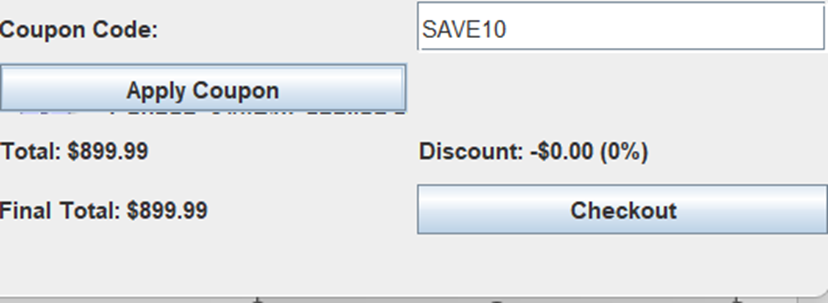

# Online Shopping Cart Simulation

Online Shopping Cart Simulation is a Java Swing-based e-commerce desktop application. It simulates a full shopping lifecycle from authentication through product management, cart operations, and checkout.

## Team Contributors

- K Mamatha (24B11CS229) - Team Lead (Database)
- A Srija (24B11CS009) - Backend
- A Kavya Sri (24B11CS010) - Frontend
- A Pravallika (24B11CS011) - Testing and Documentation

## Overview

This project was built as an academic capstone with a modular design and clear separation of responsibilities.

## Key Features

- Role-based login (Admin/User) with separate workflow
- Admin dashboard for product management (add/update/delete)
- Product list view with search and stock status
- User dashboard for cart management and checkout
- Coupon code application
- Password reset and forgot password support

## Screenshots (located in `/Screenshots`)

| Login | Admin Login | User Login |
| --- | --- | --- |
|  |  |  |

| Admin Dashboard | Product Details | Stock Update |
| --- | --- | --- |
|  |  |  |

| User Dashboard | Cart View | Checkout |
| --- | --- | --- |
|  |  |  |

## Project Structure

- `src/` - Java source code
- `bin/` - compiled classes
- `images/` - product images
- `Screenshots/` - UI screenshots
- `products.txt`, `users.txt`, `discounts.txt` - data files

## Run Instructions

1. Compile:

   ```cmd
   cd /d c:\Users\mamat\OneDrive\Desktop\OnlineShoppingCart_finish
   "C:\Program Files\Java\jdk-25\bin\javac.exe" -d bin src\*.java
   ```

2. Run:

   ```cmd
   cd /d c:\Users\mamat\OneDrive\Desktop\OnlineShoppingCart_finish
   "C:\Program Files\Java\jdk-25\bin\java.exe" -cp bin Main
   ```

## Login Credentials (default)

- Admin: `admin` / `admin123`
- User: create via Signup in app

## Notes

- Requires Java JDK 17+ (JDK 25 recommended)
- Ensure MySQL is running if using DB-backed features
- `admin_credentials.txt` stores admin user data

## Troubleshooting

- If: `Could not find or load main class Main`:
  - confirm `bin\Main.class` exists
  - run with `java -cp bin Main`
- If: `AdminCredentialStore cannot be resolved`:
  - delete `bin` folder
  - rebuild with `javac -d bin src\*.java`

## Academic Use

This repo is a BTech project demonstrating desktop e-commerce simulation, modular Java design, and team collaboration.
